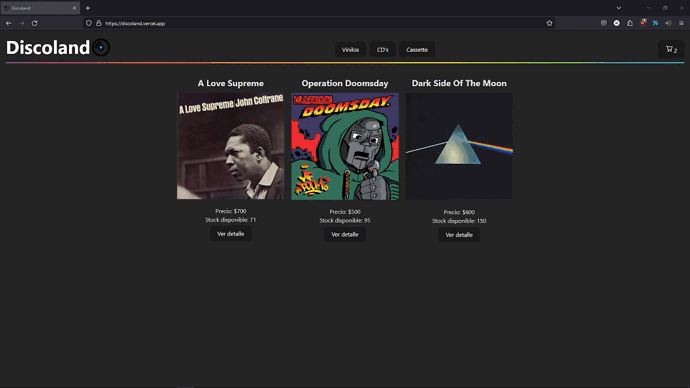

# Discoland
## Online record store (ecommerce)

Discoland is a personal project to show the knowledge in JavaScript and ReactJS.

## Features

- It's powered/hosted with Vercel. So you can visit it here https://discoland.vercel.app/
- You can navigate the web with with the different tags in the navbar. This will filter the products by default.
- You can enter your product cart in which you will be able to delete products or do your checkout.
- There is a detail view for every product in the store. This includes the ramaining stock.
- You can choose how many of each product do you want and add it to your basket.
- You can of course go back to the home screen by clicking the logo.

## Tech

This project uses the next technology:

- [ReactJS] - This web page is developed using ReactJS/VITE
- [Native CSS] - I didn't applied any CSS library in this project.
- [Firebase] - Firebase and firestore used as the main data base.
- [Vercel] - Hosted by Vercel.

## Visual preview
